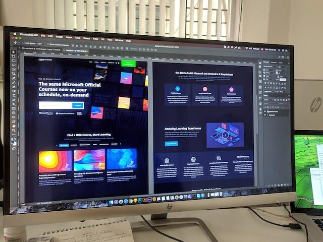

Having an online store is a great way to make money and build a business. However, it won't be successful unless your customers can find it. Creating a well-designed landing page is one of the most important steps you can take to ensure that your online store is seen by potential customers.

## Designing

<Stack spacing={[5,5,10]} direction="row">
  <Thumbnail></Thumbnail>
  <Thumbnail></Thumbnail>
</Stack>

When designing your landing page, it is important to consider the customer experience. Think about the user journey, from the moment they arrive on your page to when they leave. Make sure it is a smooth, easy-to-navigate experience. Include relevant information about your store and products, as well as a clear call to action.

## Optimizing

Once you have a design in place, you can start optimizing your landing page to maximize its effectiveness. This includes things like optimizing for search engine visibility, using visuals to draw attention, and testing different versions of your page to see which works best.

## Writing great copy

The copy on your landing page is also important. It should be concise, engaging, and persuasive. It should also be tailored to the specific audience that you are targeting.

## Conclusion

Creating a great landing page for your online store is key to making sure that your business is seen
by potential customers. It is important to consider the design, optimization, and copy when creating
your landing page to ensure that it is effective. With a little work and effort, you can create a
great landing page that will help your business succeed.
