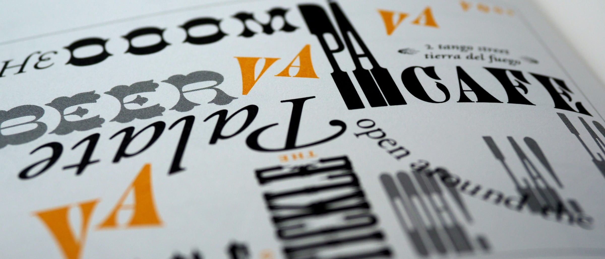
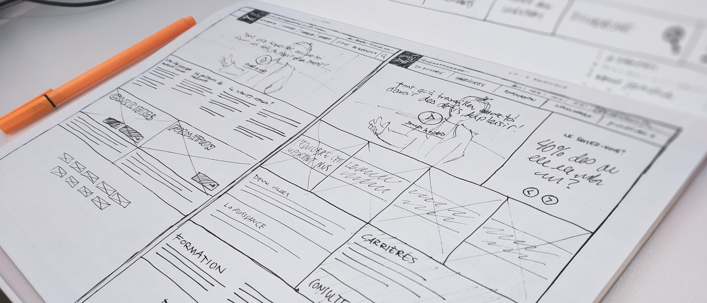
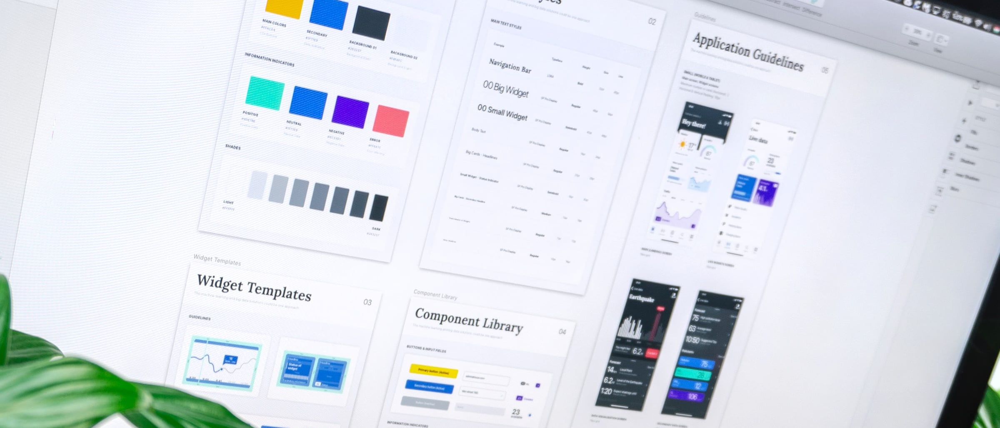

As a web designer or developer, it's important to continually look for ways to improve your skills,
staying up to date with the latest industry trends and techniques. This can be a challenge and
requires an ongoing commitment, but the reward for doing so is immense. Not only will you be able to
deliver the best possible products to your clients, you'll also be able to stay competitive in the
industry and stand out from the competition. Whether you're just starting out in web design or have
been working in the field for a while, there are always new technologies to explore and learn.
Taking the time to do so not only shows your ambition and dedication, but also sets you apart from
your peers.

Having a website for your business is essential for staying competitive in today’s digital world. Unfortunately, many business owners don’t know the basics of website design and end up with a website that doesn’t look professional or function properly. Here are 5 tips to help you improve your website design and make it stand out from the competition.

## 1. Choose the right colors

Choosing the right colors for your website can be the difference between a site that looks professional and one that looks amateurish. Make sure the colors you select complement each other and fit the overall theme of your website. If you’re not sure what colors to use, there are plenty of online resources to help you find the best color scheme for your website.

## 2. Use appropriate fonts

Choosing the right fonts is also important for making a good impression on visitors. Make sure the fonts you use are professional and legible. If you’re not sure which fonts to use, there are plenty of free font libraries available online that can help.

## 3. Make your site responsive

In today’s world, it’s essential for your website to be responsive and look good on any device. Make sure your website is optimized for both desktop and mobile devices. If you don’t know how to do this, there are plenty of online tutorials to help you get started.

## 4. Optimize for search engines

Optimizing your website for search engines is essential for getting more traffic to your site. Make sure you use keywords in your content, use meta tags, and submit your site to search engines.

## 5. Keep it simple

Keep your website design simple and avoid using too many complicated elements. If a visitor comes to your site and finds it difficult to navigate, they are unlikely to stay. Make sure your website is easy to navigate and that visitors can quickly find what they are looking for.

## Conclusion

Having a well-designed website can make a huge difference for your business. Make sure you use the
right colors, fonts, and elements to make your website look professional and be sure to optimize
your website for search engines. With these tips, you can improve your website design and make it
stand out from the competition.
